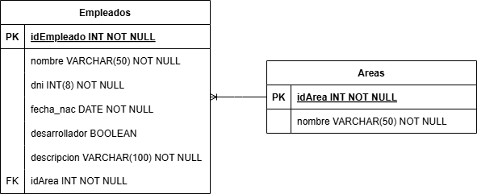

# Pineda_Challenge_Gob
---
# DER

---
# Primera Instancia
Implementé la estructura que va a tener el repositorio, diviendo backend y frontend, así como la base de un proyecto Angular y una API Rest con PHP.

# Segunda Instancia
Decidir el apartado visual de la página para el '/home' y '/alta'.

# Tercera Instancia
Comenzar con la implementación de la api y las conexiones a la DB.

# Cuarta Instancia
Probar el funcionamiento al conectar backend con frontend.

# Quinta Instancia
Implementar el alta

# Sexta Instancia
Implementar actualizar y eliminar 